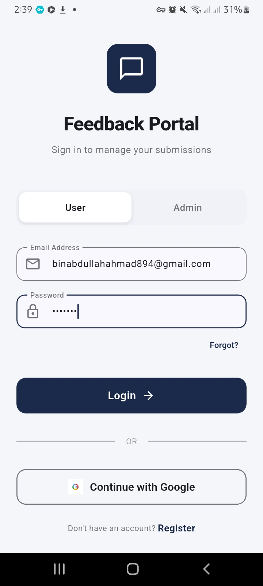
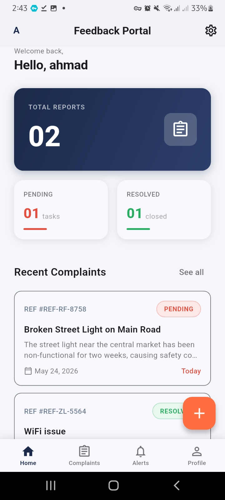
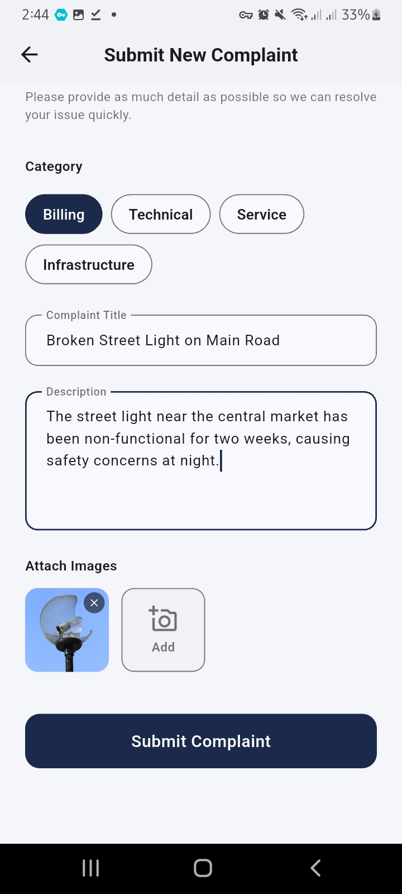
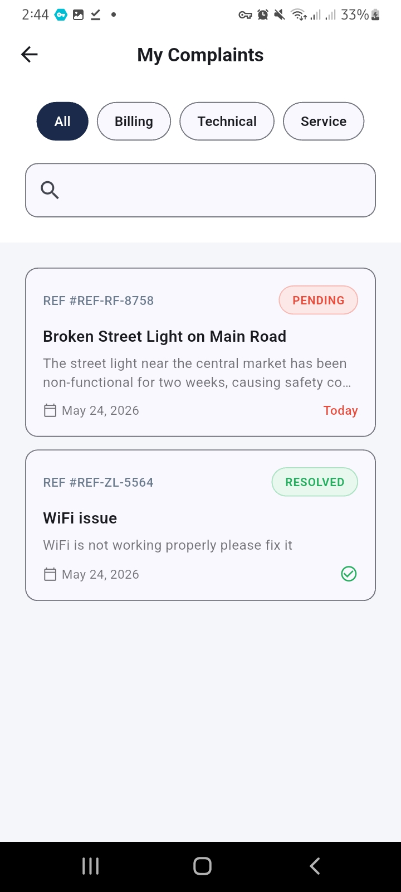
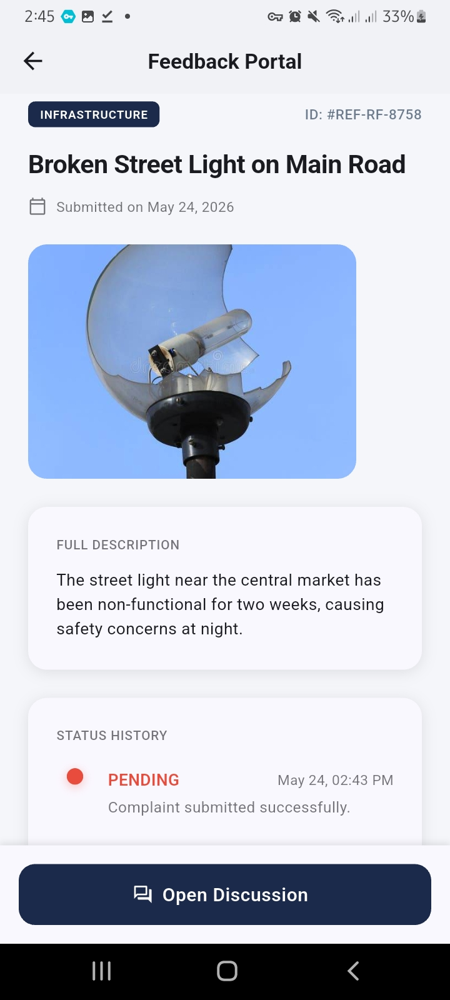
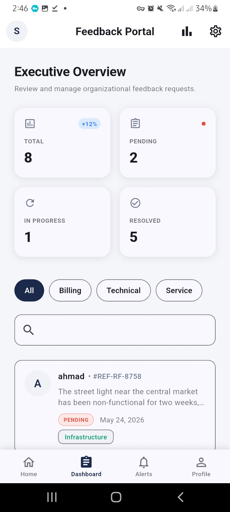
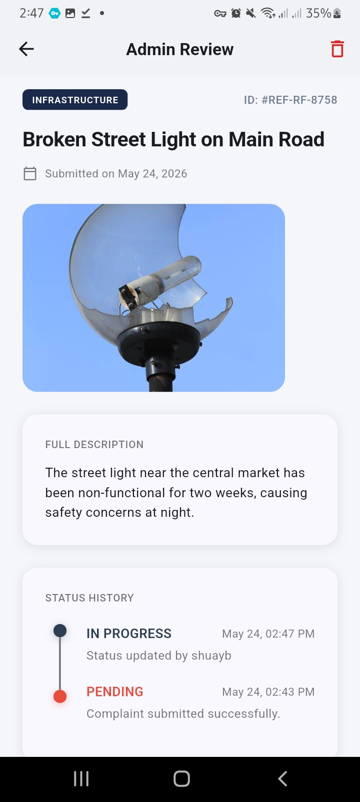
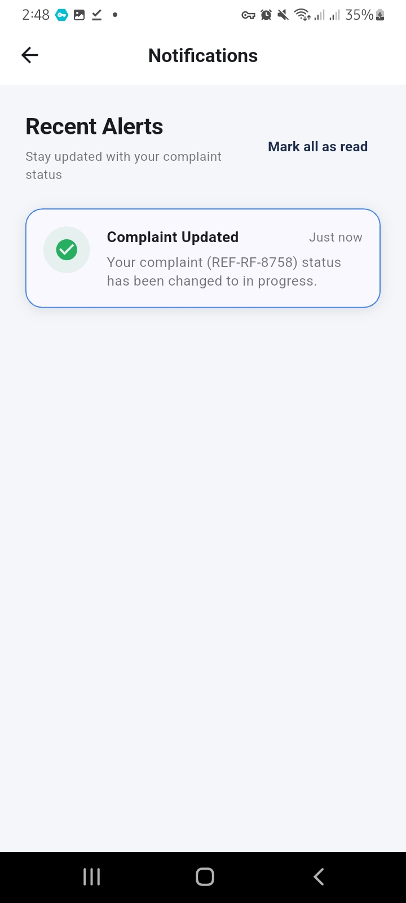

# 📢 Complaint & Feedback Management System

A mobile application built with **Flutter & Firebase** that gives the general public a structured, transparent, and accountable channel to submit complaints, track their status in real time, and receive notifications on resolution — replacing informal and ineffective reporting methods.

---
## 📄 Documentation

[Download Full Project Documentation](Complaint_Feedback_system_documentation.docx)

---
## 📲 Download App

[⬇️ Download APK (Android)](complaint-app-final-release.apk)

---
## 📱 Screenshots

### 🔐 Login Screen


> The login screen of the **Feedback Portal** — users can sign in with their email and password or use **Google Sign-In** for quick access. New users can register via the link at the bottom.

---

### 🏠 User Home Dashboard


> The home dashboard gives users an instant overview of their activity — **Total Reports**, **Pending** tasks, and **Resolved** complaints shown as summary cards. Recent complaints are listed below with their current status and date.

---

### 📝 Submit New Complaint


> The complaint submission form lets users select a **category** (Billing, Technical, Service, Infrastructure), enter a **title** and **description**, and attach a **photo as evidence**. Designed to be filled in under a minute.

---

### 📋 My Complaints List


> The My Complaints screen shows all submissions by the user with clear **status badges** — red for Pending, green for Resolved. Users can filter by category using the chips at the top or search by keyword.

---

### 🔍 Complaint Detail & Status History


> Tapping any complaint opens the full detail view — showing the **attached image**, full description, and a **Status History timeline** with timestamps for every stage the complaint has gone through.

---

### 📊 Admin Executive Dashboard


> The admin dashboard provides an **Executive Overview** with four live statistics cards: Total, Pending, In Progress, and Resolved. Below the cards, admins see the full complaint list with category tags and can filter or search across all submissions.

---

### ✏️ Admin Review & Status Update


> Admins can open any complaint to review the full details, attached image, and description. The **Status History timeline** shows the complete progression — in this case from **Pending → In Progress** — with the admin name and timestamp recorded for each update.

---

### 🔔 User Notifications


> The notifications screen delivers **real-time alerts** whenever a complaint status changes. Users are notified instantly without needing to manually check — here confirming that complaint REF-RF-8758 has been moved to **In Progress**.

---

## ✨ Features

### User Side
- 🔐 Register & login with email/password or Google Sign-In
- 📝 Submit complaints with title, category, description, and photo attachment
- 📋 View all submitted complaints with status badges
- 🔍 Filter by category and search by keyword
- 📊 Track status history: **Pending → In Progress → Resolved**
- 🔔 Real-time push notifications on every status change
- ⭐ Rate the resolution of a closed complaint

### Admin Side
- 📈 Executive dashboard with live statistics
- 📂 View and filter all complaints by category, status, and date
- ✏️ Respond to complaints and update their status
- 🕐 Full status history timeline per complaint

### Additional
- 🌐 English & Amharic language support
- 🔒 Role-based access control via Firebase Security Rules
- 📶 Offline error handling with retry support

---

## 🛠️ Tech Stack

| Layer | Technology |
|-------|-----------|
| Mobile Framework | Flutter (Dart) |
| State Management | Provider / Riverpod |
| Database | Firebase Firestore |
| Authentication | Firebase Auth (Email + Google) |
| File Storage | Firebase Storage |
| Push Notifications | Firebase Cloud Messaging (FCM) |
| Version Control | Git / GitHub |

---

## 🚀 Getting Started

### Prerequisites
- Flutter SDK `>=3.0.0`
- Dart SDK `>=3.0.0`
- A Firebase project with Firestore, Auth, Storage, and FCM enabled

### Installation

```bash
# 1. Clone the repository
git clone https://github.com/your-username/compliantApp.git
cd compliantApp

# 2. Install dependencies
flutter pub get

# 3. Add your Firebase config
# Place google-services.json in android/app/
# Place GoogleService-Info.plist in ios/Runner/

# 4. Run the app
flutter run
```

### Firebase Setup
1. Create a project at [Firebase Console](https://console.firebase.google.com)
2. Enable **Authentication** (Email/Password + Google)
3. Create a **Firestore** database in production mode
4. Enable **Firebase Storage**
5. Set up **Cloud Messaging** for push notifications
6. Apply the security rules below

---

## 🗂️ Project Structure

```
lib/
├── main.dart
├── core/
│   ├── auth_service.dart
│   └── notification_service.dart
├── features/
│   ├── auth/
│   │   ├── login_screen.dart
│   │   └── register_screen.dart
│   ├── complaints/
│   │   ├── submit_complaint_screen.dart
│   │   ├── my_complaints_screen.dart
│   │   ├── complaint_detail_screen.dart
│   │   └── complaint_repository.dart
│   ├── admin/
│   │   ├── admin_dashboard.dart
│   │   └── admin_complaint_detail.dart
│   ├── notifications/
│   │   └── notifications_screen.dart
│   └── profile/
│       └── profile_screen.dart
└── shared/
    ├── status_badge.dart
    ├── custom_button.dart
    └── loading_widget.dart
```

---

## 🔒 Firestore Security Rules

```javascript
rules_version = '2';
service cloud.firestore {
  match /databases/{database}/documents {
    match /complaints/{id} {
      allow read: if request.auth != null &&
        (resource.data.userId == request.auth.uid || isAdmin());
      allow create: if request.auth != null;
      allow update: if isAdmin();
    }
    function isAdmin() {
      return get(/databases/$(database)/documents/users/$(request.auth.uid))
               .data.role == 'admin';
    }
  }
}
```

---

## 🗄️ Database Collections

| Collection | Description |
|------------|-------------|
| `users` | User profiles with role field (`user` / `admin`) |
| `complaints` | All submitted complaints with status and history |
| `notifications` | Status-change alerts per user |
| `categories` | Complaint category definitions |

---

## 🧪 Testing

- ✅ 15 manual test cases covering all core flows
- ✅ Unit tests for auth, repository, and validators
- ✅ Integration tests for submit → admin → notify flow
- ✅ UAT with 6 participants — **4.66 / 5.0 satisfaction score**

---

## 🔮 Planned Features

- 🤖 AI-based complaint auto-categorization (Gemini API)
- 📱 SMS notification support
- ⏱️ Auto-escalation for unresolved complaints past a deadline
- 📉 Advanced analytics and reporting for admins

---

<p align="center">Made with ❤️ — Feedback Portal, May 2026</p>
